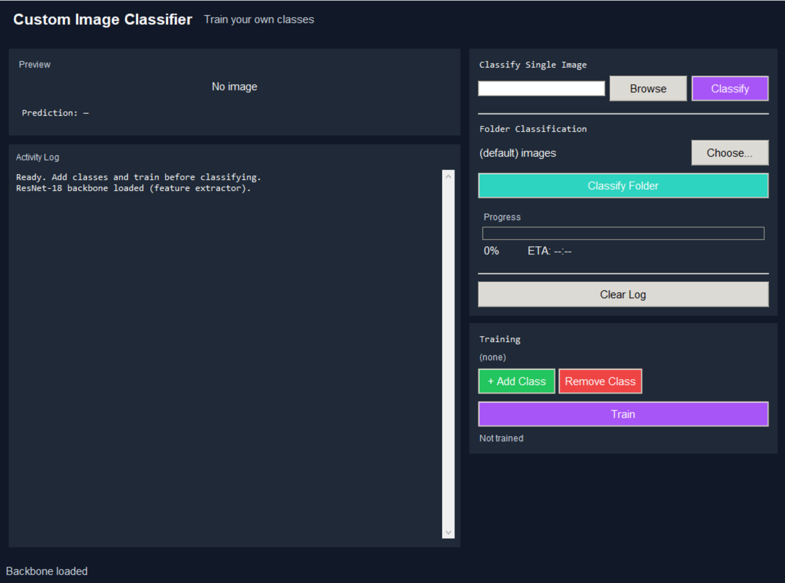
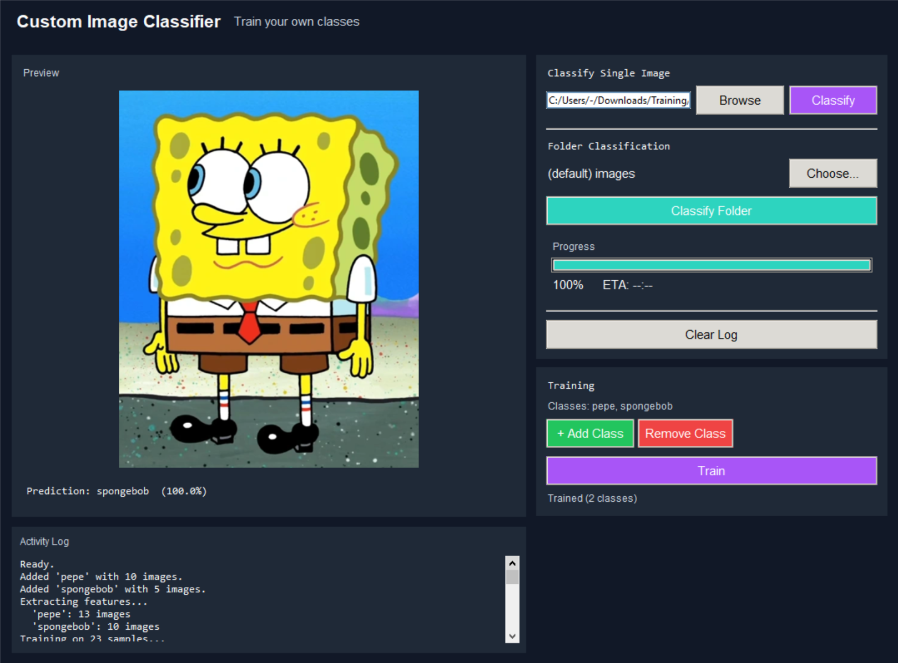

# CustomImageClassifier

<p align="center">
  
</p>

<h1 align="center">CustomImageClassifier</h1>

<p align="center">
  A modern bulk image classification tool powered by a <b>ResNet-18</b> backbone.
  <br>
  Built to make custom image training simple, fast, and actually enjoyable.
</p>

<p align="center">
  
  
  
  
</p>

---

# ✨ Overview

**CustomImageClassifier** is a lightweight but powerful image classification tool designed for people who want to train custom AI image models without dealing with complicated machine learning workflows.

Instead of forcing you through massive setups, painful configuration, or bloated frameworks, this project keeps things straightforward:

- Define your classes
- Add training images
- Train the model
- Classify images in bulk

Simple.

The application uses a **pretrained ResNet-18 backbone** as a frozen feature extractor, making training significantly faster while still achieving strong results on custom datasets.

Whether you're sorting datasets, experimenting with AI, building tools, or just messing around with computer vision, this tool makes the process clean and beginner-friendly.

---

# 🚀 Features

## 🧠 AI Powered Classification

- Uses a pretrained **ResNet-18** backbone
- Frozen feature extractor for faster training
- Efficient and lightweight
- Good accuracy with relatively small datasets

---

## 🖼️ Bulk Image Classification

Classify large groups of images quickly and efficiently.

Perfect for:
- Dataset sorting
- Organization
- Automation
- Experimental AI projects
- Custom workflows

---

## ⚡ Beginner Friendly

No advanced ML knowledge required.

You don't need to:
- Build neural networks manually
- Train giant models from scratch
- Understand complicated pipelines

Just provide images and train.

---

## 💾 Persistent Model Saving

- Trained weights save automatically
- Class information persists between sessions
- No retraining every launch

---

## 🎨 Modern UI

Designed with a clean and simple interface that focuses on usability instead of clutter.

---

# 📸 Screenshots

## Casual Preview

<p align="center">
  
</p>

---

## In Use

<p align="center">
  
</p>

---

# ⚙️ How It Works

The project uses a pretrained **ResNet-18** model from PyTorch.

Instead of retraining the entire neural network, the backbone remains frozen and acts purely as a feature extractor.

This means:
- Faster training
- Lower hardware requirements
- Better efficiency
- Easier custom dataset training

The classifier head is trained on your custom image classes while the pretrained ResNet handles feature extraction internally.

This approach is ideal for:
- Small-to-medium datasets
- Personal projects
- Quick experimentation
- Efficient custom classification tasks

---

# 📦 Installation

All setup instructions are included at the top of `main.py`.

Install required dependencies:

```bash
pip install torch torchvision pillow
